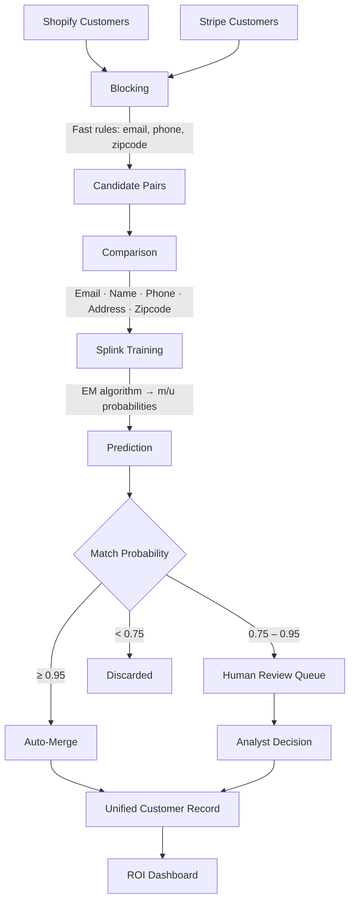

# Customer Unification Agent

AI-powered agent for cross-platform customer record reconciliation and unification.

## Project Overview

This agent automatically detects and unifies duplicate customer records across multiple e-commerce platforms (Shopify, Stripe, etc.) using probabilistic record linkage (Splink). It produces confidence-scored match predictions, routes high-confidence pairs to auto-merge and borderline pairs to a human review queue, and surfaces business ROI metrics via a Streamlit dashboard.

## Live Page

A static project page lives in `docs/index.html` and is published via GitHub Pages. It mirrors the dashboard aesthetic — KPI cards, Plotly charts, Mermaid pipeline diagram, and match statistics — using the real numbers from the latest run.

To enable it: go to **Settings → Pages → Source → Deploy from branch `main`, folder `/docs`**.

## Setup

### 1. Create Virtual Environment

```bash
python -m venv .venv
```

### 2. Activate Virtual Environment

**On macOS/Linux:**
```bash
source .venv/bin/activate
```

**On Windows:**
```bash
.venv\Scripts\activate
```

### 3. Install Dependencies

```bash
pip install -r requirements.txt
```

## Usage

### Generate Synthetic Data

```bash
python generate_synthetic_data.py
```

Creates:
- `shopify_customers.csv` — 425 Shopify customer records
- `stripe_customers.csv` — 425 Stripe customer records
- `ground_truth.csv` — True customer identities for validation

### Add Hard Cases (optional)

```bash
python add_hard_cases.py
```

Appends 20 intentionally tricky duplicates (name variations, phone formatting differences, address abbreviations) to create `*_with_hard_cases.csv` variants.

### Run the Matching Engine

```bash
python matching_engine.py
```

Runs the full Splink probabilistic record linkage pipeline and writes:
- `auto_merge_matches.csv` — Pairs with ≥95% confidence (safe to merge automatically)
- `review_queue_matches.csv` — Pairs with 75–95% confidence (flagged for human review)
- `validation_metrics.json` — Precision/recall against ground truth

### Test Hard Cases

```bash
python test_hard_cases.py
```

Runs the matching pipeline on the hard-cases dataset and reports how many tricky duplicates were caught vs. missed.

### Preview Dashboard Metrics (CLI)

```bash
python analyze_metrics.py
```

### Launch the ROI Dashboard

```bash
streamlit run dashboard.py
```

Opens a live Streamlit dashboard showing:
- Summary KPIs (total records, duplicates found, unique customers, match precision)
- Hidden customer value unlocked by unification
- Top 10 cross-platform customers by combined lifetime value
- Customer value distribution chart
- VIP and cross-sell opportunity insights
- Match confidence score distribution

## Project Structure

```
customer-unification-agent/
├── config.py                           # All thresholds, file paths, and tuning parameters
├── data.py                             # Schema-validated data loading (single source of truth for I/O)
├── matching_engine.py                  # Splink probabilistic matching pipeline
├── metrics.py                          # Shared business KPI calculations
├── dashboard.py                        # Streamlit ROI dashboard
├── generate_synthetic_data.py          # Synthetic data generator (500 customers, 70% cross-platform)
├── add_hard_cases.py                   # Appends hard-to-match duplicate scenarios
├── test_hard_cases.py                  # Evaluates matching performance on hard cases
├── analyze_metrics.py                  # CLI preview of dashboard metrics
├── quick_check.py                      # Quick sanity-check script
├── requirements.txt                    # Python dependencies
│
├── shopify_customers.csv               # Generated Shopify records
├── stripe_customers.csv                # Generated Stripe records
├── ground_truth.csv                    # True customer identities
├── shopify_customers_with_hard_cases.csv
├── stripe_customers_with_hard_cases.csv
├── ground_truth_with_hard_cases.csv
│
├── auto_merge_matches.csv              # Output: high-confidence matches (383 pairs)
├── review_queue_matches.csv            # Output: borderline matches (9 pairs)
└── validation_metrics.json             # Output: precision/recall metrics
```

## How It Works



1. **Blocking** — Candidate pairs are generated using fast blocking rules (exact email, email prefix, phone, zipcode) to avoid O(n²) comparisons.
2. **Comparison** — Each candidate pair is scored across five signals:
   - Email (Levenshtein distance ≤1, ≤2)
   - Name (Jaro-Winkler similarity ≥0.9, ≥0.8)
   - Phone (Levenshtein distance ≤2, ≤5)
   - Address (Levenshtein distance ≤5, ≤10)
   - Zipcode (exact match)
3. **Training** — Splink estimates match/non-match probabilities via random sampling (u-probabilities) and EM algorithm (m-probabilities).
4. **Prediction** — Each pair receives a `match_probability` score between 0 and 1.
5. **Categorization** — Pairs above 0.95 are auto-merged; pairs between 0.75–0.95 go to the review queue.

## Key Configuration (`config.py`)

| Parameter | Default | Description |
|---|---|---|
| `AUTO_MERGE_THRESHOLD` | 0.95 | Confidence above which records auto-merge |
| `REVIEW_THRESHOLD` | 0.75 | Confidence above which records go to review queue |
| `DEFAULT_N_CUSTOMERS` | 500 | Number of customers in synthetic data |
| `DEFAULT_CROSS_PLATFORM_RATE` | 0.70 | Fraction of customers present on both platforms |
| `VIP_SPEND_THRESHOLD` | $2,000 | Minimum combined spend to qualify as a VIP |

## Status

| Milestone | Status |
|---|---|
| Generate synthetic data | ✅ Done |
| Implement Splink matching engine | ✅ Done |
| Build merge logic with confidence thresholds | ✅ Done |
| Create Streamlit review dashboard | ✅ Done |
| Build ROI metrics layer | ✅ Done |
| Hard case stress testing | ✅ Done |
| Real Shopify/Stripe API integration | ⏳ Not started |
| Database persistence (PostgreSQL) | ⏳ Not started |
